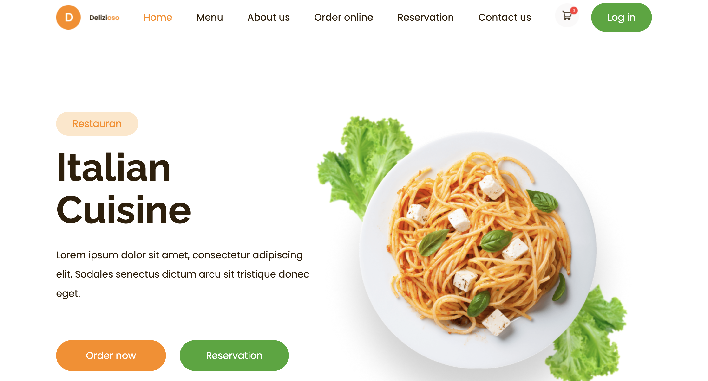
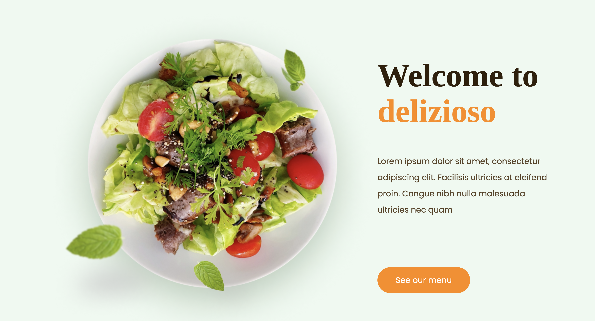
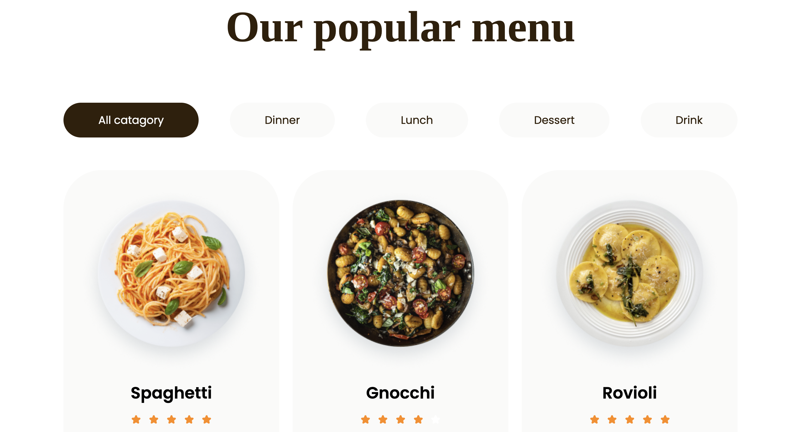
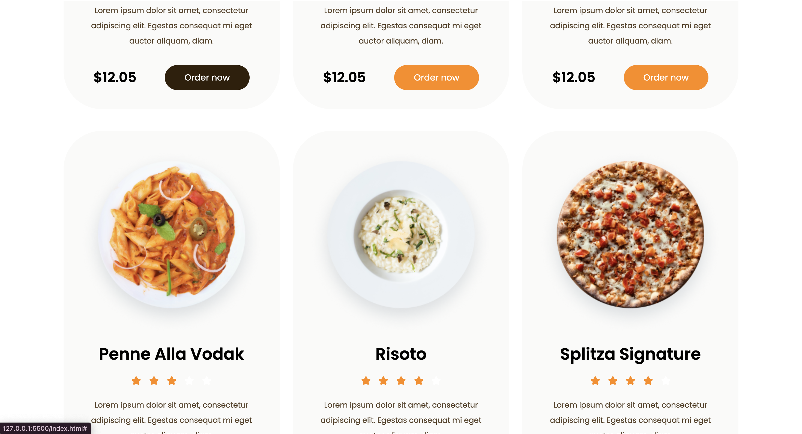
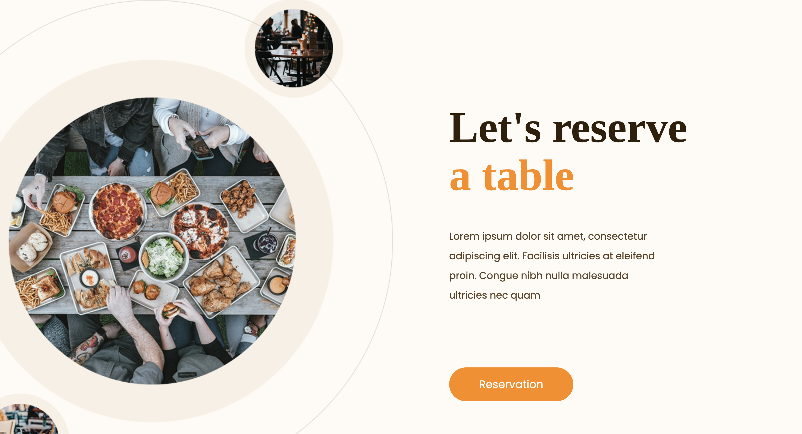
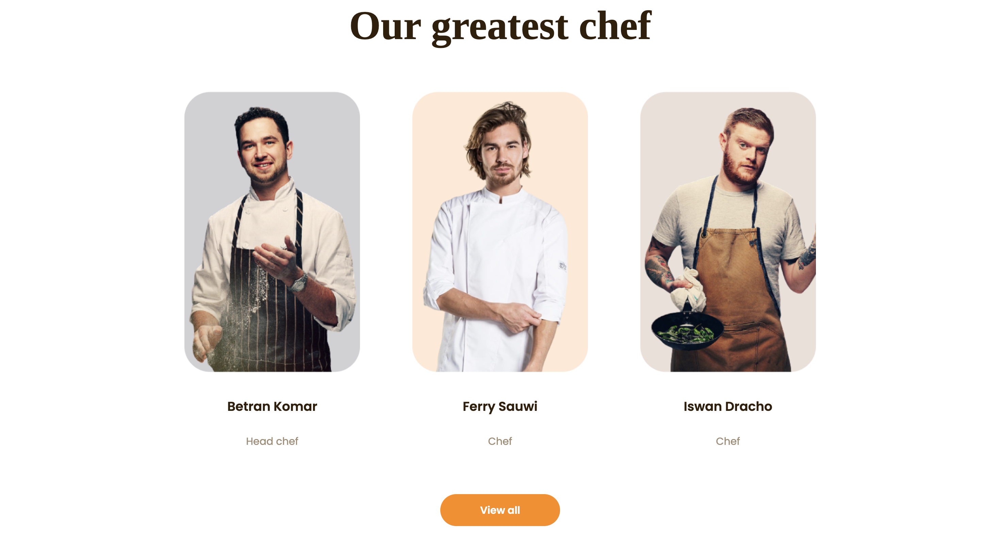
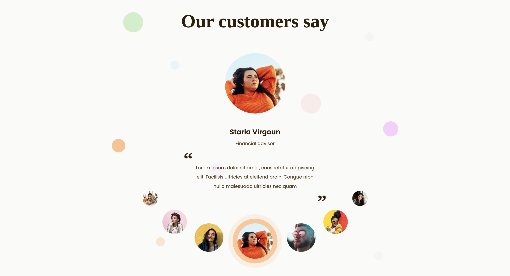
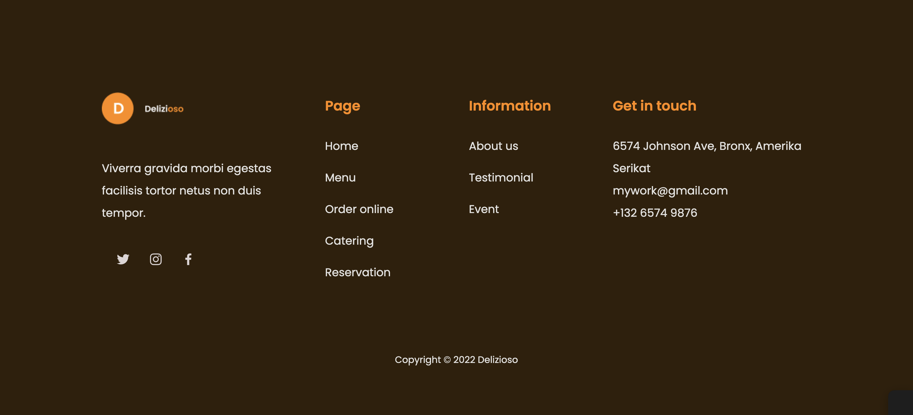

# Restaurant Layout

## 🛠️ Technologies Used  

- **HTML5** – webpage structure.  
- **CSS3 (Flexbox & Grid)** – styling.  
- **Google Fonts (Poppins, Raleway, Tinos)** – stylish and readable typography.  

## Getting Started
1. Open `index.html` in any brawser.